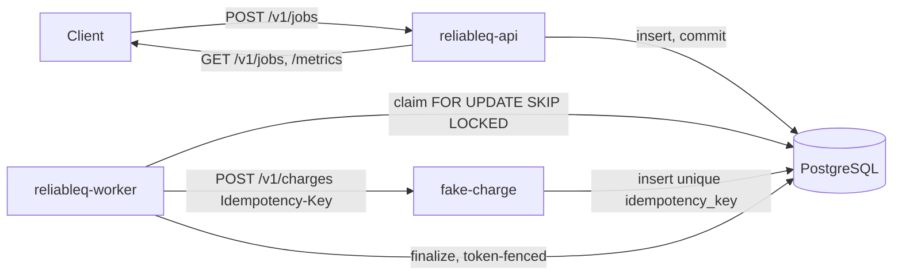

# ReliableQ Design

This document states what ReliableQ guarantees, what it explicitly does not
guarantee, and the state machine that the rest of the implementation is
built around. It is the reference other documents (ADRs, failure lab,
blog posts) point back to when explaining *why* a mechanism exists.

## 1. Guarantees

1. **Durable acceptance.** Once `POST /v1/jobs` returns `202 Accepted`, the
   job row has committed to PostgreSQL and will not silently disappear.
2. **At-least-once execution.** A worker crash, network partition, or lease
   expiry can cause a job's side effect to be attempted more than once.
   ReliableQ does not prevent this; it makes it survivable.
3. **Idempotent bundled side effect.** The included fake charge service
   deduplicates by idempotency key at the database layer, so repeated
   attempts of the *same job* produce at most one charge row.
4. **Recoverable abandoned work.** A worker that dies mid-job leaves a
   `RUNNING` row with a bounded lease. Once the lease expires, any worker
   can reclaim and finish it — no operator intervention required.
5. **Fenced finalization.** Only the current lease holder can renew or
   finalize a job. A stale worker that resumes after losing its lease
   cannot overwrite the outcome produced by whoever reclaimed the job.
6. **Bounded, observable retries.** Transient failures retry on a capped
   exponential backoff with full jitter, up to a configured attempt
   budget. Permanent failures and exhausted budgets move to a terminal
   `DEAD` state instead of retrying forever.
7. **Terminal state reachability.** Every accepted job eventually reaches
   `SUCCEEDED` or `DEAD`, assuming PostgreSQL and workers stay available
   and the job's own retry budget is respected.
8. **Bounded concurrency.** Each worker process holds at most a configured
   number of jobs in flight at once.

## 2. Explicit non-guarantees

- **Not exactly-once execution.** The job handler can and will run more
  than once for the same job under crash/lease-expiry scenarios. Only the
  bundled charge service's idempotency key makes the *externally visible*
  effect happen once. A handler without an idempotent downstream cannot
  inherit this property for free.
- **Not exactly-once delivery to arbitrary external systems.** Idempotency
  is scoped to the one bundled side effect (`fake-charge`), keyed by
  `reliableq:charge:<job_uuid>`. Swapping in a different downstream
  service requires that service to offer an equivalent dedup mechanism.
- **Not a workflow/DAG engine.** No job dependencies, priorities, cron
  scheduling, or multi-tenant fairness.
- **Not horizontally sharded or multi-region.** A single PostgreSQL
  instance is the source of truth; there is no distributed consensus.
- **Not a message broker replacement.** PostgreSQL row locking
  (`FOR UPDATE SKIP LOCKED`) is the concurrency primitive — no Kafka,
  RabbitMQ, or Redis.
- **No production auth/authz.** The HTTP API is unauthenticated; it is not
  meant for direct public internet exposure.
- **No automatic retention/archival.** Completed and dead jobs remain in
  the `jobs` table indefinitely in v1.

## 3. State machine

```text
PENDING  --claim--------------------------> RUNNING
RUNNING  --successful effect--------------> SUCCEEDED
RUNNING  --retryable failure--------------> PENDING (scheduled in future)
RUNNING  --permanent/exhausted failure----> DEAD
RUNNING  --lease expires------------------> claimable RUNNING by a new owner
DEAD     --manual retry-------------------> PENDING (explicit new retry cycle)
```

- `PENDING` and `RUNNING` are the only non-terminal states.
- `SUCCEEDED` and `DEAD` are terminal: neither is automatically claimable.
- An expired `RUNNING` row is claimable directly by any worker; there is
  no separate reaper process. Claiming it replaces the lease
  owner/token and increments `attempts` atomically in one transaction.
- `DEAD -> PENDING` only happens through the explicit
  `POST /v1/jobs/{id}/retry` operator action. It reuses the same job ID
  (and therefore the same downstream idempotency key), keeps historical
  attempts, and continues attempt numbering monotonically.

Every transition is guarded by a `WHERE` predicate on current status
(and, for `RUNNING` rows, the lease token) and verified by checking the
affected row count. A transition that matches zero rows means the caller's
view of the job was stale, and the caller must not assume it happened.

## 4. Architecture



The API server and worker are independent binaries sharing the
`reliableq-core` (domain types, state transitions, retry math) and
`reliableq-db` (migrations, repository queries) library crates. Multiple
worker processes operate safely against the same database because all
claim/renew/finalize operations are guarded, row-locked SQL statements —
never process-local mutexes.

## 5. Job state fields relevant to recovery

| Field | Purpose |
|---|---|
| `next_attempt_at` | When a `PENDING` job becomes due |
| `lease_token` / `lease_expires_at` | Who owns a `RUNNING` job and until when |
| `attempts` / `max_attempts` | Retry budget enforcement |
| `version` | Optimistic concern surfaced in audit trail; guarded updates are the actual concurrency control |

Lease expiry and due-job comparisons always use database time
(`now()` in PostgreSQL), never worker wall-clock time, so clock skew
between worker processes cannot cause premature or late reclaiming.

## 6. Learning progression

This repository is built by reproducing each failure before adding the
mechanism that fixes it (see `docs/failure-lab.md` and `docs/adr/`):

1. Naive queue with no lease sophistication → stranded `RUNNING` work.
2. Add leases and fencing → stranded work becomes recoverable.
3. Naive charge calls → duplicate charge on crash-after-commit.
4. Add idempotency key uniqueness → duplicate becomes a replay.
5. Immediate retries → thundering herd against a failing dependency.
6. Add capped exponential backoff with full jitter → bounded retry load.
7. Unbounded retries → jobs retry forever on permanent failures.
8. Add dead-letter terminal state → operators can inspect and replay.
9. Unbounded concurrency → dependency overload under load.
10. Add a semaphore and capacity-aware claiming → bounded concurrency.
