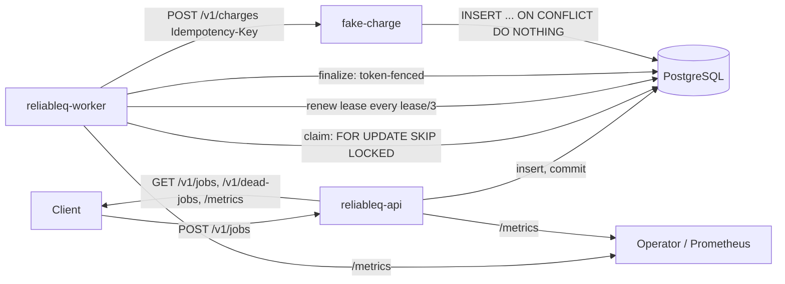
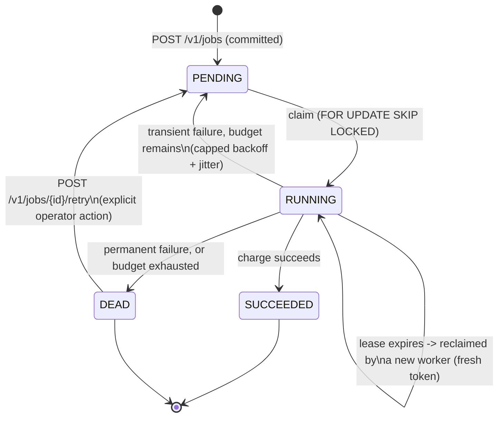

# ReliableQ

[](https://github.com/cb7chaitanya/ReliableQ/actions/workflows/ci.yml)
[](rust-toolchain.toml)
[](LICENSE)
[](docs/failure-lab.md)

A durable, PostgreSQL-backed background-job system in Rust, built
around one honest guarantee: **at-least-once execution, not
exactly-once**. Clients `POST` a job over HTTP and it commits to
Postgres before the API acknowledges it; a bounded pool of worker
processes then claims and executes it — via expiring, token-fenced
leases — against a downstream (a bundled fake charge service). A
worker crash or lease expiry can make a job run twice, and this
project doesn't hide that: the one bundled side effect is deduplicated
by a deterministic, job-scoped idempotency key, so a job that runs
twice still only charges once. Transient failures retry with capped,
jittered backoff; permanent or budget-exhausted failures land in an
inspectable, explicitly-replayable `DEAD` state instead of retrying
forever or vanishing.

Every one of those mechanisms was added to fix a *reproduced* failure,
not a hypothetical one — `docs/failure-lab.md` walks through each
invariant, the naive design that violated it, the concrete reproduction
(a real crashed process, a real duplicate call), and the fix — and the
same failure classes are re-verified continuously by a seeded,
concurrent multi-worker chaos test suite.

> Status: all 8 milestones complete (M0-M8). 107 tests passing, fmt
> clean, clippy clean, seeded multi-worker chaos suite passing across
> repeated runs. See [`docs/failure-lab.md`](docs/failure-lab.md) for
> the full reproduce-then-fix reasoning trail and
> [`docs/interview-notes.md`](docs/interview-notes.md) for a guided
> walkthrough.

## Guarantees, in one paragraph

Once `POST /v1/jobs` returns `202`, the job has committed and will not
silently disappear. A worker crash or lease expiry can cause the same
job's handler to run more than once (at-least-once, not
exactly-once) — this project does not hide that fact, it makes it
survivable: the one bundled side effect (a charge) is deduplicated by
a deterministic, job-scoped idempotency key, so a job that runs twice
still only charges once. Transient failures retry with bounded,
jittered backoff; permanent failures and exhausted retry budgets land
in an inspectable, explicitly-replayable `DEAD` state. Concurrency is
bounded per worker process. See
[`DESIGN.md`](DESIGN.md#1-guarantees) for the complete list and its
mirror, [`DESIGN.md` sec. 2](DESIGN.md#2-explicit-non-guarantees), for
what this project deliberately does not promise.

## Quick start

Requires the pinned toolchain in `rust-toolchain.toml` (installed
automatically by `rustup` if you have it) and Docker.

```bash
cp .env.example .env

make up        # start local postgres (docker compose)
make migrate   # apply migrations
make gate      # fmt-check + clippy + full test suite (needs `make up` first)
```

Run each binary individually:

```bash
make run-api            # reliableq-api   :8080  (also serves /metrics)
make run-worker         # reliableq-worker        (metrics on :9091)
make run-fake-charge    # fake-charge     :8081
```

`make down` stops postgres. See `Makefile` for every target.

### Demo


Recording generated with [VHS](https://github.com/charmbracelet/vhs) from
[`scripts/reliableq-demo.tape`](scripts/reliableq-demo.tape) — a
reproducible, checked-in definition, not a hand-edited video. Regenerate
it with `vhs scripts/reliableq-demo.tape` after `make up`, `make
migrate`, and building the three binaries. For the full guided version
with explanatory step banners, run it yourself:

```bash
scripts/demo.sh
```

A ~1-2 minute guided run (build time aside) through: normal
submission -> success; a real transient downstream failure that
retries with visible backoff and recovers; a genuine worker crash
(`kill -9`, not simulated) leaving a job stranded, followed by
lease-expiry reclaim by a second worker; proof that the reclaimed job
— now attempted twice — produced exactly one committed charge; and a
permanently-rejected job going `DEAD`, appearing in `GET
/v1/dead-jobs`, and succeeding after an explicit `POST .../retry`.

### Manual walkthrough

With `make run-fake-charge`, `make run-api`, and `make run-worker` all
running:

```bash
curl -s -X POST http://127.0.0.1:8080/v1/jobs \
  -H 'Content-Type: application/json' \
  -d '{"kind":"charge","payload":{"customer_id":"c1","amount_cents":500,"currency":"INR"},"max_attempts":5}'

curl -s http://127.0.0.1:8080/v1/jobs/<id-from-above>
curl -s http://127.0.0.1:8080/v1/dead-jobs
curl -s http://127.0.0.1:8080/metrics
curl -s http://127.0.0.1:9091/metrics
```

## Testing

```bash
make gate                                          # fmt-check + clippy + full test suite
DATABASE_URL=... cargo test --workspace --all-features   # same, directly
cargo test -p reliableq-chaos-tests --test seeded_chaos -- --nocapture   # chaos suite alone, with output
```

Every crate's tests run against a live, isolated PostgreSQL schema
(created and dropped per test) — `make up` (or an equivalent running
Postgres reachable at `DATABASE_URL`) is a prerequisite for anything
beyond the pure-logic unit tests in `reliableq-core`.

## Architecture



The API and worker are independent binaries (`crates/reliableq-api`,
`crates/reliableq-worker`) sharing the `reliableq-core` (domain types,
config, retry math, redaction) and `reliableq-db` (migrations, query
repository) library crates. Multiple worker processes safely share one
queue — claiming is `FOR UPDATE SKIP LOCKED` inside a short
transaction with no network call inside it, never a process-local
mutex.

## Job state machine



`SUCCEEDED` and `DEAD` are terminal and never automatically claimed.
See [`DESIGN.md` sec. 3](DESIGN.md#3-state-machine) for the full
column-level detail (lease tokens, timestamps, constraints).

## Repository layout

```text
crates/
  reliableq-core/     domain types, config, retry math, redaction — no I/O
  reliableq-db/        migrations + query repository (sqlx, PostgreSQL)
  reliableq-api/       API binary: submit/get/list/retry, health, /metrics
  reliableq-worker/     worker binary: poll/claim/execute/finalize, /metrics
  fake-charge/          idempotent downstream side effect + chaos injection
migrations/             SQL migrations (source of truth for schema)
tests/integration/      end-to-end happy path (api + worker + fake-charge)
tests/chaos/             seeded multi-worker chaos suite
docs/
  adr/                  7 ADRs — one per major design decision
  blog/                 5-part series: reproduce-then-fix narrative
  failure-lab.md         milestone-by-milestone invariant/failure/fix log
  operations.md          startup/shutdown/inspection/recovery procedures
  interview-notes.md     60s summary, deep dive, trade-offs, extensions
scripts/demo.sh          guided end-to-end demo
```

## Non-guarantees

ReliableQ provides at-least-once execution, not exactly-once, and its
idempotency guarantee is scoped to the one bundled charge handler, not
a general framework. See
[`DESIGN.md` sec. 2](DESIGN.md#2-explicit-non-guarantees) for the full
list of what this project deliberately does not do, and
[`SPEC.md` sec. 3](SPEC.md) for the original non-goals.

## Further reading

- [`DESIGN.md`](DESIGN.md) — guarantees, non-guarantees, state machine, architecture.
- [`docs/failure-lab.md`](docs/failure-lab.md) — every milestone's invariant, naive design, failure window, reproduction evidence, and fix.
- [`docs/adr/`](docs/adr/) — 7 ADRs: PostgreSQL as queue, at-least-once semantics, lease/fencing, idempotency scope, retry algorithm, bounded concurrency/shutdown, observability design.
- [`docs/blog/`](docs/blog/) — 5-part narrative series derived from the actual implementation and test evidence.
- [`docs/operations.md`](docs/operations.md) — day-to-day procedures.
- [`docs/interview-notes.md`](docs/interview-notes.md) — 60-second summary through honest production extensions.
- [`SPEC.md`](SPEC.md) — the original implementation brief this project was built from.

## License

MIT — see [`LICENSE`](LICENSE).
