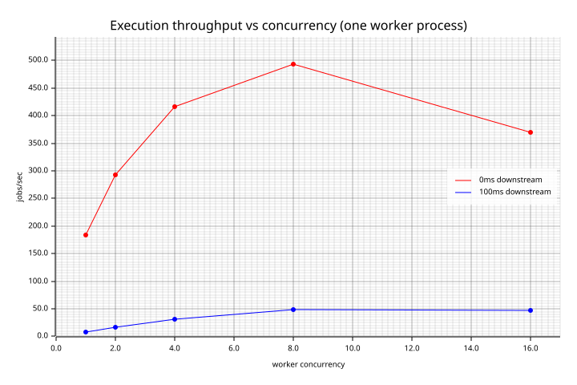
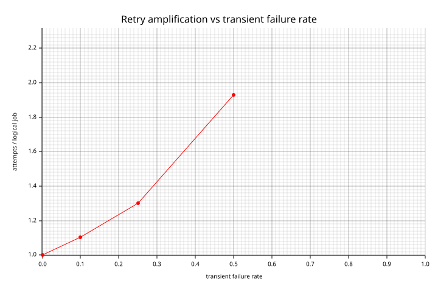
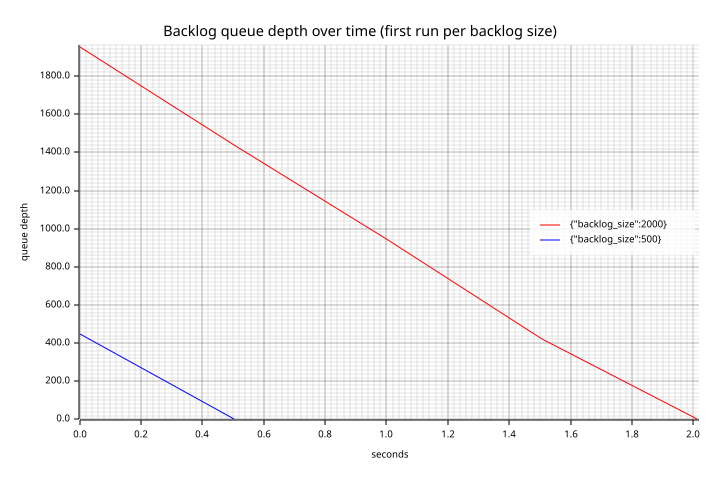

# ReliableQ Benchmark Results

Generated by `reliableq-bench report` from 126 raw run file(s) under `benchmarks/results/` (0 excluded for a dirty worktree). Every number below comes from that raw data — nothing here is hand-typed. See [`docs/benchmarking/design.md`](design.md) for methodology, workload model, and known noise sources.

**These are local-machine benchmarks, not universal capacity claims** — see design.md sec. 8 for the specific environment and its known sources of noise.

## Executive summary

126 runs across 10 scenarios, 126/126 passing every correctness check (docs/benchmarking/design.md sec. 7). No single number below stands in for the whole system — read this alongside the per-scenario tables and charts, not instead of them.

- **Ingestion** (API + PostgreSQL insert only, zero workers) peaked at 4770 committed submissions/sec at `{"concurrency":32}`.
- **Execution overhead** (0ms downstream) peaked at 493 jobs/sec at `{"downstream_latency_ms":0,"worker_concurrency":8}` — this is ReliableQ's own claim/execute/finalize machinery, not the downstream.
- **Retry amplification** ranged up to 1.93 attempts per logical job at a 50% transient failure rate (see the retry_degradation table and chart for the full curve).
- A **real `kill -9`** of a live worker recovered in 5.5s on average (lease duration 5s) with zero duplicate charges across every repeat.

## Environment

| Field | Value |
|---|---|
| Git commit | `0739f1cf94859f77aff587de74a086fc1230a0f8` |
| Rust | rustc 1.94.0 (4a4ef493e 2026-03-02) |
| OS | macos 24.4.0 (aarch64) |
| CPU | Apple M3 |
| Logical CPUs | 8 |
| Memory | 16.0 GiB |
| Docker | 27.4.0 |
| PostgreSQL | PostgreSQL 16.14 on aarch64-unknown-linux-musl, compiled by gcc (Alpine 15.2.0) 15.2.0, 64-bit |
| Build profile | release |

## Correctness gate

126/126 runs passed every correctness check (docs/benchmarking/design.md sec. 7). Any run below with a failed gate has its performance numbers reported but **must not** be read as valid — see `correctness_results.failures` in its raw JSON.

## Results by scenario

### `backlog`

| Params | Runs | Throughput (jobs_per_sec) | p50 (ms) | p95 (ms) | p99 (ms) | Max (ms) | Correctness |
|---|---|---|---|---|---|---|---|
| `{"backlog_size":2000}` | 3 | 862.9 | 1429.3 | 2103.5 | 2159.6 | 2173.2 | pass |
| `{"backlog_size":500}` | 3 | 618.5 | 551.9 | 713.8 | 729.1 | 730.0 | pass |

### `claim_batch`

| Params | Runs | Throughput (jobs_per_sec) | p50 (ms) | p95 (ms) | p99 (ms) | Max (ms) | Correctness |
|---|---|---|---|---|---|---|---|
| `{"batch_size":10}` | 3 | 114.2 | 2169.9 | 3392.8 | 3546.6 | 3553.9 | pass |
| `{"batch_size":1}` | 3 | 44.4 | 4215.1 | 8802.5 | 9039.1 | 9104.9 | pass |
| `{"batch_size":25}` | 3 | 119.5 | 1902.5 | 3326.7 | 3358.3 | 3366.3 | pass |
| `{"batch_size":50}` | 3 | 123.4 | 1796.1 | 2790.3 | 2820.5 | 2827.2 | pass |
| `{"batch_size":5}` | 3 | 113.4 | 2119.8 | 3449.6 | 3602.7 | 3609.8 | pass |

### `crash_recovery_failpoint`

| Params | Runs | Throughput (jobs_per_sec) | p50 (ms) | p95 (ms) | p99 (ms) | Max (ms) | Correctness |
|---|---|---|---|---|---|---|---|
| `{"failpoint":"after_claim_before_effect"}` | 3 | 3.8 | 2060.0 | 2060.0 | 2060.0 | 2060.0 | pass |
| `{"failpoint":"after_effect_before_finalize"}` | 3 | 3.7 | 2081.4 | 2081.4 | 2081.4 | 2081.4 | pass |
| `{"failpoint":"during_finalize"}` | 3 | 213.8 | n/a | n/a | n/a | n/a | pass |

### `crash_recovery_real_kill`

| Params | Runs | Throughput (jobs_per_sec) | p50 (ms) | p95 (ms) | p99 (ms) | Max (ms) | Correctness |
|---|---|---|---|---|---|---|---|
| `{"lease_duration_secs":5}` | 3 | 0.5 | 5370.3 | 5376.7 | 5376.7 | 5376.7 | pass |

### `downstream_latency_sensitivity`

| Params | Runs | Throughput (jobs_per_sec) | p50 (ms) | p95 (ms) | p99 (ms) | Max (ms) | Correctness |
|---|---|---|---|---|---|---|---|
| `{"downstream_latency_ms":0,"worker_concurrency":8}` | 3 | 291.0 | 432.3 | 566.7 | 582.2 | 582.4 | pass |
| `{"downstream_latency_ms":100,"worker_concurrency":8}` | 3 | 43.8 | 2527.1 | 4419.8 | 4566.5 | 4566.9 | pass |
| `{"downstream_latency_ms":25,"worker_concurrency":8}` | 3 | 104.3 | 1729.4 | 2233.7 | 2282.6 | 2283.3 | pass |
| `{"downstream_latency_ms":500,"worker_concurrency":8}` | 3 | 14.7 | 7198.0 | 13019.4 | 13547.6 | 13547.9 | pass |

### `execution`

| Params | Runs | Throughput (jobs_per_sec) | p50 (ms) | p95 (ms) | p99 (ms) | Max (ms) | Correctness |
|---|---|---|---|---|---|---|---|
| `{"downstream_latency_ms":0,"worker_concurrency":16}` | 3 | 369.3 | 1082.7 | 1368.9 | 1400.2 | 1401.3 | pass |
| `{"downstream_latency_ms":0,"worker_concurrency":1}` | 3 | 183.5 | 1198.7 | 2007.9 | 2075.9 | 2095.1 | pass |
| `{"downstream_latency_ms":0,"worker_concurrency":2}` | 3 | 292.3 | 825.7 | 1272.4 | 1317.4 | 1327.0 | pass |
| `{"downstream_latency_ms":0,"worker_concurrency":4}` | 3 | 415.5 | 631.5 | 890.3 | 913.7 | 920.7 | pass |
| `{"downstream_latency_ms":0,"worker_concurrency":8}` | 3 | 492.6 | 559.3 | 725.0 | 739.3 | 739.9 | pass |
| `{"downstream_latency_ms":100,"worker_concurrency":16}` | 3 | 46.7 | 3246.5 | 8929.1 | 10139.3 | 10141.7 | pass |
| `{"downstream_latency_ms":100,"worker_concurrency":1}` | 3 | 8.2 | 24591.9 | 46259.0 | 48222.9 | 48708.9 | pass |
| `{"downstream_latency_ms":100,"worker_concurrency":2}` | 3 | 16.1 | 12659.7 | 23577.3 | 24554.5 | 24799.2 | pass |
| `{"downstream_latency_ms":100,"worker_concurrency":4}` | 3 | 31.0 | 6667.4 | 12193.3 | 12695.0 | 12822.0 | pass |
| `{"downstream_latency_ms":100,"worker_concurrency":8}` | 3 | 48.6 | 3693.9 | 8698.7 | 9010.4 | 9011.4 | pass |

### `idempotency_contention`

| Params | Runs | Throughput (requests_per_sec) | p50 (ms) | p95 (ms) | p99 (ms) | Max (ms) | Correctness |
|---|---|---|---|---|---|---|---|
| `{"concurrency":16}` | 3 | 1627.4 | 8.4 | 9.2 | 9.8 | 9.8 | pass |
| `{"concurrency":1}` | 3 | 655.0 | 1.5 | 1.5 | 1.5 | 1.5 | pass |
| `{"concurrency":4}` | 3 | 291.3 | 13.7 | 13.7 | 13.7 | 13.7 | pass |
| `{"concurrency":64}` | 3 | 2649.7 | 19.3 | 23.8 | 24.0 | 24.0 | pass |

### `ingestion`

| Params | Runs | Throughput (requests_per_sec) | p50 (ms) | p95 (ms) | p99 (ms) | Max (ms) | Correctness |
|---|---|---|---|---|---|---|---|
| `{"concurrency":1}` | 3 | 1524.2 | 0.5 | 1.3 | 2.1 | 10.5 | pass |
| `{"concurrency":32}` | 3 | 4769.5 | 6.4 | 8.8 | 10.5 | 10.8 | pass |
| `{"concurrency":8}` | 3 | 4721.4 | 1.6 | 2.6 | 4.0 | 4.8 | pass |

### `retry_degradation`

| Params | Runs | Throughput (jobs_per_sec) | p50 (ms) | p95 (ms) | p99 (ms) | Max (ms) | Correctness |
|---|---|---|---|---|---|---|---|
| `{"transient_failure_rate":0.0}` | 3 | 153.4 | 991.5 | 1304.5 | 1346.0 | 1348.6 | pass |
| `{"transient_failure_rate":0.1}` | 3 | 93.6 | 1369.8 | 2008.0 | 2138.9 | 2308.9 | pass |
| `{"transient_failure_rate":0.25}` | 3 | 68.7 | 1245.1 | 1848.2 | 2096.0 | 3111.5 | pass |
| `{"transient_failure_rate":0.5}` | 3 | 34.8 | 609.6 | 2509.0 | 3928.5 | 5701.4 | pass |

### `scaling`

| Params | Runs | Throughput (jobs_per_sec) | p50 (ms) | p95 (ms) | p99 (ms) | Max (ms) | Correctness |
|---|---|---|---|---|---|---|---|
| `{"axis":"fixed_total_concurrency","concurrency_per_worker":2,"total_concurrency":8,"worker_count":4}` | 3 | 287.1 | 1518.6 | 2330.8 | 2396.9 | 2407.3 | pass |
| `{"axis":"fixed_total_concurrency","concurrency_per_worker":4,"total_concurrency":8,"worker_count":2}` | 3 | 244.9 | 1145.2 | 1668.0 | 1719.9 | 1730.2 | pass |
| `{"axis":"fixed_total_concurrency","concurrency_per_worker":8,"total_concurrency":8,"worker_count":1}` | 3 | 210.8 | 1058.2 | 1612.7 | 1645.4 | 1673.8 | pass |
| `{"axis":"increasing_total_concurrency","concurrency_per_worker":4,"total_concurrency":16,"worker_count":4}` | 3 | 756.3 | 1189.3 | 1493.7 | 1522.9 | 1531.4 | pass |
| `{"axis":"increasing_total_concurrency","concurrency_per_worker":4,"total_concurrency":4,"worker_count":1}` | 3 | 106.4 | 1868.9 | 3009.4 | 3107.6 | 3139.9 | pass |
| `{"axis":"increasing_total_concurrency","concurrency_per_worker":4,"total_concurrency":8,"worker_count":2}` | 3 | 245.0 | 1214.6 | 1712.2 | 1763.1 | 1773.1 | pass |

## Analysis

### Throughput vs. concurrency and saturation point

1->2 workers: 184->292 jobs/sec (+59%); 2->4 workers: 292->416 jobs/sec (+42%); 4->8 workers: 416->493 jobs/sec (+19%); 8->16 workers: 493->369 jobs/sec (-25%); 

Marginal throughput gain from added concurrency drops below 15% past **8 workers** at 0ms downstream latency on this machine — consistent with claim/finalize transaction overhead (not the downstream) becoming the bottleneck. Treat this as a local, 8-logical-CPU-laptop number, not a universal ceiling.

### Claim-batch sensitivity

Batch size 1 was slowest (44 jobs/sec) and batch size 50 was fastest (123 jobs/sec) in this run — batching more due-jobs per claim transaction amortizes transaction overhead, but this driver bypasses the compiled worker binary's own hardcoded batch cap (see docs/benchmarking/design.md sec. 2), so treat this as evidence about the claim/execute pipeline's shape, not the shipped binary's throughput.

### Backlog drain

- A 2000-job backlog (workers started cold, no preexisting in-flight work) drained in 2.3s on average, sustaining 863 jobs/sec — see the queue-depth-over-time chart below for the drain curve's shape, not just its endpoints.
- A 500-job backlog (workers started cold, no preexisting in-flight work) drained in 0.8s on average, sustaining 618 jobs/sec — see the queue-depth-over-time chart below for the drain curve's shape, not just its endpoints.

### Crash-recovery timelines

- **Real `kill -9`**: worker killed 1.1s after start; full recovery (lease expiry + reclaim + successful finalize by a second real worker process) took 5.5s total against a 5s lease.
- **Failpoint `after_claim_before_effect`** (driven directly, not through the compiled worker binary — see design.md sec. 2): median crash-to-reclaim gap 2060ms against a 2s lease.
- **Failpoint `after_effect_before_finalize`** (driven directly, not through the compiled worker binary — see design.md sec. 2): median crash-to-reclaim gap 2081ms against a 2s lease.
- **Failpoint `during_finalize`** (driven directly, not through the compiled worker binary — see design.md sec. 2): median crash-to-reclaim gap 0ms against a 2s lease.

### Resource use vs. throughput

| Params | Throughput (jobs/sec) | Worker CPU avg/peak % | Worker RSS peak | API CPU avg/peak % | Postgres CPU % |
|---|---|---|---|---|---|
| `{"downstream_latency_ms":0,"worker_concurrency":16}` | 369 | 47.1/47.1 | 8.4 MiB | 2.9/5.4 | 2.2 |
| `{"downstream_latency_ms":0,"worker_concurrency":1}` | 184 | 22.9/49.8 | 7.5 MiB | 1.3/6.1 | 1.7 |
| `{"downstream_latency_ms":0,"worker_concurrency":2}` | 292 | 25.3/49.3 | 7.8 MiB | 1.6/6.0 | 2.3 |
| `{"downstream_latency_ms":0,"worker_concurrency":4}` | 416 | 33.7/49.3 | 7.9 MiB | 2.4/6.6 | 2.1 |
| `{"downstream_latency_ms":0,"worker_concurrency":8}` | 493 | 50.2/50.2 | 8.4 MiB | 3.7/6.9 | 1.5 |
| `{"downstream_latency_ms":100,"worker_concurrency":16}` | 47 | 6.6/40.0 | 9.0 MiB | 0.4/5.1 | 2.1 |
| `{"downstream_latency_ms":100,"worker_concurrency":1}` | 8 | 1.9/48.9 | 7.4 MiB | 0.1/5.2 | 2.0 |
| `{"downstream_latency_ms":100,"worker_concurrency":2}` | 16 | 3.0/50.4 | 7.6 MiB | 0.1/5.7 | 1.7 |
| `{"downstream_latency_ms":100,"worker_concurrency":4}` | 31 | 4.4/45.0 | 7.9 MiB | 0.2/4.6 | 1.0 |
| `{"downstream_latency_ms":100,"worker_concurrency":8}` | 49 | 6.6/41.8 | 8.5 MiB | 0.4/5.8 | 1.3 |

## Limitations and likely sources of noise

- **Single developer laptop, not a dedicated benchmarking host** — Docker Desktop's Linux VM on macOS, shared CPU/scheduler with the rest of the system, no CPU pinning. See docs/benchmarking/design.md sec. 8 for the full list of known noise sources (Docker Desktop's VM disk layer, `ps`-based CPU sampling granularity, the 5s `/metrics` gauge refresh cadence this harness deliberately avoids by polling PostgreSQL directly, etc.).

- **A real host sleep/wake corrupted an earlier run of this exact suite** — several `execution` runs came back with multi-hour p95/p99 latencies from a job whose lifetime spanned the laptop going to sleep (PostgreSQL wall-clock timestamps include the sleep gap; the harness's own monotonic `measurement_duration_secs` did not, which is exactly how it was caught). Fixed by adding a correctness check comparing latency samples against each run's own monotonic elapsed time (see the `bench: catch host-sleep clock corruption` commit) and re-running clean with the host kept awake (`caffeinate -dims`). The numbers in this report are from that clean re-run — 126/126 correctness checks passing, none excluded for this reason.

- **This report is generated from the quick profile only** (`benchmarks/config/quick.toml`) — smaller job counts and fewer concurrency points than `full.toml`, and it excludes the 100k-job backlog point entirely. The full profile has not been executed end-to-end to produce a published baseline; see `make bench-full` and this repository's own completion report for the exact reasoning (time/disk budget on this specific run).

- **Sample sizes are small** (job counts in the hundreds per scenario point, not thousands) — tail percentiles (p99, max) from a few hundred samples are directional, not statistically tight. Largest single-scenario job count in this report: 2000.

## Charts







## Reproduction

```bash
make up && make migrate
cargo build --workspace --release
make bench-quick   # or: make bench-full
make bench-report
```

Raw results live under `benchmarks/results/<scenario>/<params>/`. Regenerate this file and its charts from that raw data alone with `make bench-report` — nothing in this document is hand-edited.
